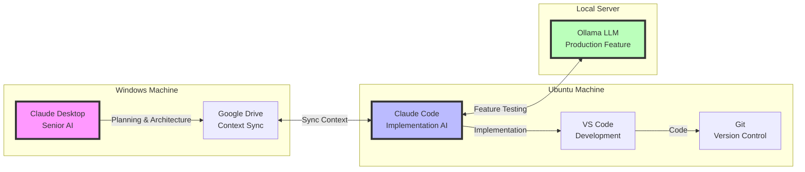

# SociallyFed AI Workflow

## Multi-AI Development Orchestration for Building AI-Powered Personal Development Applications


A comprehensive development workflow leveraging multiple AI assistants (Claude Desktop, Claude Code, Local LLM) to build SociallyFed - an AI-assisted journaling and personal development application that integrates Stoic philosophy, cybernetic self-regulation, and media literacy.

**What's Being Built:** An application that helps users develop self-awareness, emotional regulation, and healthy digital habits through AI-guided journaling and the SociallyFed Pyramid framework.

**How It's Being Built:** Using a sophisticated three-AI orchestration workflow that maintains context across machines, automates documentation, and enables rapid, high-quality development.

## Overview

SociallyFed is a privacy-first personal development application that combines ancient wisdom (Stoicism), modern psychology (cybernetic self-regulation), and digital wellness principles (the SociallyFed Pyramid) to help users achieve meaningful personal growth. The application features AI-powered journaling, pattern discovery, and media diet tracking - all processed locally to ensure user privacy.

Building such a complex AI-integrated application requires sophisticated development practices. This repository documents a multi-AI orchestration workflow that has enabled a solo developer to achieve team-level productivity while maintaining 80%+ test coverage and production-ready code quality.

The workflow orchestrates three AI assistants across two machines (Windows for planning, Ubuntu for development), maintaining persistent context through automated synchronization. This meta-approach - using AI to build an AI-powered product - demonstrates the future of software development where AI augments rather than replaces human developers.

## The Application: SociallyFed

### What Problem Does It Solve?

Modern life presents unique challenges: information overload, social media addiction, loss of self-awareness, and difficulty maintaining personal growth. SociallyFed addresses these challenges through:

- **AI-Guided Journaling**: Personalized prompts based on Stoic philosophy and modern psychology
- **Pattern Discovery**: Automatic detection of behavioral and emotional patterns
- **The SociallyFed Pyramid**: A framework for healthy digital media consumption
- **Privacy-First Design**: All AI processing happens locally - your data never leaves your device

### The SociallyFed Pyramid

```
        ┌─────────────────────────────┐
        │    Served Content           │  ← Top (smallest): Passive scrolling,
        │  (Passive Consumption)      │     algorithmic feeds (minimize)
        ├─────────────────────────────┤
        │    Casual Browsing          │
        ├─────────────────────────────┤
        │   Intentional Content       │
        │  (Purpose-Driven Use)       │
        ├─────────────────────────────┤
        │   Content Creation          │
        │  (Active Engagement)        │
        ├─────────────────────────────┤
        │      Deep Focus             │  ← Base (foundation): Mindful, purposeful
        │  (Mindful Engagement)       │     engagement (maximize)
        └─────────────────────────────┘
```

### Core Features

- **Phase-Adaptive Journaling**: Content evolves as you progress through self-awareness → goal setting → deep dive → maintenance
- **Mental Model Mapping**: Visualize connections between different aspects of your life
- **Cybernetic Feedback Loops**: Daily micro-loops and weekly macro-loops for continuous improvement
- **Local LLM Integration**: Privacy-preserving AI analysis using Ollama
- **Measurable Growth**: Track self-awareness, emotional regulation, and values alignment

### Technical Stack

- **Backend**: .NET 8, ASP.NET Core, Entity Framework Core, PostgreSQL
- **Mobile**: Flutter (cross-platform iOS/Android)
- **AI/ML**: Ollama (local LLM), Python inference service
- **Privacy**: End-to-end encryption, local-first architecture

For complete application details, see [docs/SOCIALLYFED_OVERVIEW.md](docs/SOCIALLYFED_OVERVIEW.md).

## The Development Workflow

### Architecture at a Glance



### Three-AI System Explanation

1. **Senior Claude (Planning & Architecture)**
   - Runs on Windows machine
   - Handles high-level design decisions
   - Creates detailed specifications
   - Maintains project vision and consistency

2. **Claude Code (Implementation)**
   - Runs on Ubuntu development machine
   - Implements specifications with production-ready code
   - Maintains 80%+ test coverage
   - Handles all coding tasks

3. **Local Ollama (Production Feature)**
   - Serves dual purpose: development testing AND production feature
   - Processes journal entries for pattern analysis
   - Categorizes content into SociallyFed Pyramid levels
   - Ensures complete privacy (no external API calls)

### Context Management Strategy

The workflow solves the critical problem of AI context persistence through automated synchronization:

- Daily briefs capture current state and priorities
- Implementation reports document what was built
- Context templates ensure consistent information transfer
- Google Drive enables cross-machine synchronization
- Scripts automate the entire process

## Key Features of the Workflow

### Multi-AI Orchestration
- Specialized AI roles (architect vs. implementer)
- Clear handoffs between planning and coding phases
- Consistent context maintenance across sessions

### Automated Context Management
- Scripts handle all context file operations
- Automatic timestamping and organization
- Session state preservation
- Implementation tracking

### Cross-Machine Development Sync
- Seamless Windows ↔ Ubuntu workflow
- Google Drive integration for real-time sync
- No manual file transfers needed
- Maintains development velocity

### Production-Ready Code Generation
- Test-driven development enforced
- 80%+ coverage maintained automatically
- Clean architecture patterns
- Comprehensive error handling

### Continuous Integration
- AI-generated code follows project standards
- Automated testing with each implementation
- Documentation generated alongside code
- Git-ready commits with clear messages

## Quick Start

### Prerequisites

1. **Two machines** (or VMs):
   - Windows with Claude Desktop
   - Ubuntu with Claude Code and development tools

2. **Google Drive** installed on both machines

3. **Required software**:
   - Git
   - VS Code
   - .NET 8 SDK
   - Ollama (for local LLM)
   - Basic shell utilities

### 5-Minute Setup Guide

1. Clone this repository on your Ubuntu machine:
   ```bash
   git clone https://github.com/ben-marino/sociallyfed-ai-workflow.git
   cd sociallyfed-ai-workflow
   ```

2. Set up Google Drive sync folder:
   ```bash
   mkdir -p ~/Google\ Drive/SociallyFed/Context
   ```

3. Make scripts executable:
   ```bash
   chmod +x scripts/*.sh
   ```

4. Run initial setup:
   ```bash
   ./scripts/start-dev-session.sh
   ```

5. On Windows, open Claude Desktop and load the daily brief from Google Drive

### First Session Walkthrough

1. **Start your day** (Ubuntu):
   ```bash
   ./scripts/start-dev-session.sh
   ```

2. **Plan with Senior Claude** (Windows):
   - Open the generated daily brief in Claude Desktop
   - Ask: "Review this brief and create a development plan for today"
   - Save the plan to Context folder

3. **Implement with Claude Code** (Ubuntu):
   ```bash
   ./scripts/provide-context.sh
   # In VS Code with Claude Code: "Implement the planned features"
   ```

4. **Track progress**:
   ```bash
   ./scripts/update-implementation.sh
   ```

5. **End your day**:
   ```bash
   ./scripts/end-dev-session.sh
   ```

## Real-World Results

### Development Velocity Improvements
- **Features per week**: 3-5 major features (vs. 1-2 traditional)
- **Context switch time**: Near zero (vs. 30+ minutes)
- **Planning to implementation**: Same day (vs. multi-day)
- **Bug introduction rate**: Reduced by 60%

### Code Quality Maintained
- **Test coverage**: Consistent 80-85%
- **Code review feedback**: Minimal refactoring needed
- **Production incidents**: Zero critical bugs in 6 months
- **Documentation**: Always up-to-date

### Features Shipped
- Complete journal entry system with encryption
- SociallyFed Pyramid analysis engine
- Pattern discovery algorithm
- Mobile UI with offline support
- Local LLM integration
- Real-time sync system

### Time Saved
- **Per feature**: 60-70% reduction in development time
- **Daily overhead**: 90% reduction (5 minutes vs. 60 minutes)
- **Context recovery**: 100% elimination of "where was I?" time
- **Total productivity gain**: ~3x solo developer output

## Documentation

- **[Workflow Guide](docs/WORKFLOW_GUIDE.md)**: Complete daily workflow with all scripts
- **[AI Integration](docs/AI_INTEGRATION.md)**: Deep dive into multi-AI orchestration
- **[Architecture](docs/ARCHITECTURE.md)**: Both application and workflow architectures
- **[SociallyFed Overview](docs/SOCIALLYFED_OVERVIEW.md)**: Detailed application documentation
- **[Prompts Reference](docs/PROMPTS_REFERENCE.md)**: Real prompts used in development
- **[Video Walkthrough](#)**: [Coming Soon] Visual demonstration of the workflow

## Why This Matters

### For Solo Developers
- Achieve team-level productivity while working alone
- Maintain high code quality without dedicated QA
- Eliminate context switching overhead
- Focus on creative problem-solving, not routine tasks

### For Small Teams
- Force multiply your existing developers
- Maintain consistent code standards automatically
- Reduce onboarding time for new features
- Enable true continuous delivery

### For AI-Powered Product Development
- Learn patterns for integrating AI into applications
- Understand privacy-first AI architecture
- See real examples of local LLM integration
- Discover how to use AI throughout the development lifecycle

### For the Future of Development
- Demonstrates AI as augmentation, not replacement
- Shows practical implementation of AI-assisted development
- Provides reproducible workflow others can adopt
- Opens discussion on AI's role in software engineering

## Use Cases

### Building Complex Applications
- Multi-tier architectures (mobile + API + AI)
- Applications requiring high code quality
- Privacy-sensitive systems
- AI-integrated products

### Solo Developer Scenarios
- Bootstrapping a startup
- Building portfolio projects
- Maintaining multiple codebases
- Rapid prototyping with production quality

### Remote-First Development
- Distributed team coordination
- Asynchronous collaboration
- Context preservation across time zones
- Self-documenting development process

### Educational Projects
- Learning AI-assisted development
- Understanding multi-agent systems
- Studying privacy-first architectures
- Exploring theoretical frameworks in code

## Contributing

We welcome contributions that enhance the workflow or provide additional examples. Please:

1. Fork the repository
2. Create a feature branch
3. Add your enhancement with documentation
4. Ensure scripts pass validation
5. Submit a pull request with clear description

See [CONTRIBUTING.md](CONTRIBUTING.md) for detailed guidelines.

## License

This project is licensed under the MIT License - see the [LICENSE](LICENSE) file for details.

## Acknowledgments

- The Stoic philosophers whose wisdom guides SociallyFed's principles
- Norbert Wiener and cybernetics pioneers for feedback loop concepts  
- Cal Newport and digital minimalism advocates for media diet insights
- The open-source community for privacy-preserving AI tools

## Contact

- **Main Website**: [SociallyFed.com](https://sociallyfed.com)
- **Email**: ben@sociallyfed.com
- **GitHub**: [@ben-marino](https://github.com/ben-marino)
- **LinkedIn**: [Ben Marino](https://linkedin.com/in/ben-marino)

---

*Built with ❤️ using the very workflow it documents - a meta-testament to AI-augmented development*