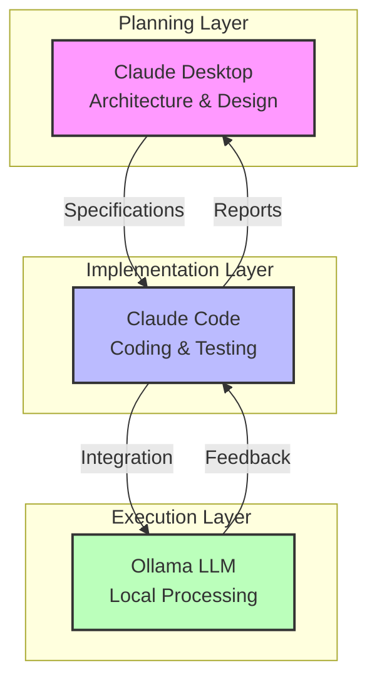
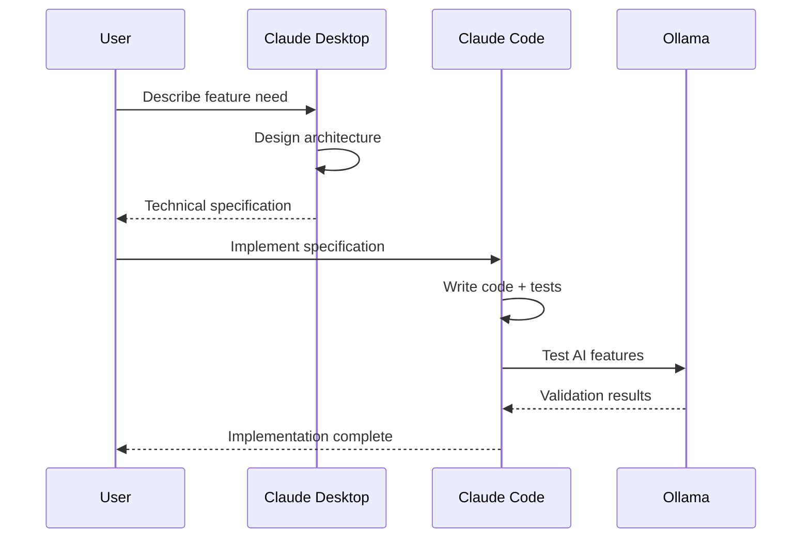

# AI Integration Guide

## Table of Contents

- [Multi-AI Architecture](#multi-ai-architecture)
- [Real-World Example: Building SociallyFed Pyramid Analysis](#real-world-example-building-sociallyfed-pyramid-analysis)
- [AI Roles and Capabilities](#ai-roles-and-capabilities)
- [Context Synchronization](#context-synchronization)
- [Integration Patterns](#integration-patterns)
- [Prompt Engineering](#prompt-engineering)
- [Performance Optimization](#performance-optimization)
- [Measuring AI Effectiveness](#measuring-ai-effectiveness)
- [Advanced Techniques](#advanced-techniques)
- [Future Enhancements](#future-enhancements)

## Multi-AI Architecture

The SociallyFed development workflow leverages three distinct AI systems, each optimized for specific tasks:



### Why Three AIs?

1. **Specialization**: Each AI excels at different tasks
2. **Parallel Processing**: Multiple aspects handled simultaneously
3. **Checks and Balances**: Cross-validation between systems
4. **Cost Optimization**: Use appropriate AI for each task

## Real-World Example: Building SociallyFed Pyramid Analysis

This three-AI system enabled rapid development of SociallyFed's core feature - the Pyramid analysis engine. Here's how it worked:

### Day 1: Architecture (2 hours)

**Senior Claude's Role:**

Created architectural specification:

```markdown
# Pyramid Analysis Engine Specification

## Overview
Design a system that categorizes user's digital media consumption into the SociallyFed Pyramid levels, from passive consumption to deep focus.

## Requirements
1. Real-time categorization of social media posts
2. Privacy-first: all processing local via Ollama
3. 95%+ accuracy on categorization
4. <2 second response time
5. Explanation of categorization decision

## Architecture

### API Layer (.NET)
```csharp
public interface IPyramidAnalysisService
{
    Task<PyramidLevel> CategorizeContent(string content);
    Task<AnalysisResult> AnalyzeWithExplanation(string content);
    Task<UserPyramidMetrics> CalculateUserMetrics(Guid userId, DateRange range);
}
```

### Local LLM Integration
- Use Ollama HTTP API
- Implement retry logic
- Cache frequent patterns
- Fallback to rule-based system if LLM unavailable

### Data Flow
1. User submits content → API endpoint
2. API validates and sanitizes input
3. API calls Ollama service
4. Ollama categorizes using prompt engineering
5. Result cached and returned
6. Metrics updated asynchronously
```

**Output**: Complete specification with interfaces, data models, and integration points

### Day 2-3: Implementation (6 hours)

**Claude Code's Role:**

Implemented the specification:

```csharp
// PyramidAnalysisService.cs
public class PyramidAnalysisService : IPyramidAnalysisService
{
    private readonly IOllamaClient _ollamaClient;
    private readonly IMemoryCache _cache;
    private readonly ILogger<PyramidAnalysisService> _logger;
    
    public async Task<PyramidLevel> CategorizeContent(string content)
    {
        // Check cache first
        var cacheKey = GenerateCacheKey(content);
        if (_cache.TryGetValue(cacheKey, out PyramidLevel cached))
            return cached;
        
        try
        {
            var prompt = BuildCategorizationPrompt(content);
            var response = await _ollamaClient.GenerateAsync(prompt);
            var level = ParsePyramidLevel(response);
            
            // Cache for 1 hour
            _cache.Set(cacheKey, level, TimeSpan.FromHours(1));
            
            return level;
        }
        catch (OllamaException ex)
        {
            _logger.LogWarning(ex, "Ollama unavailable, falling back to rules");
            return FallbackRuleBasedCategorization(content);
        }
    }
    
    private string BuildCategorizationPrompt(string content)
    {
        return $@"Categorize this social media behavior into one of 5 pyramid levels:
1. Deep Focus - Mindful, purposeful engagement
2. Content Creation - Making and sharing
3. Intentional Content - Consciously chosen consumption  
4. Casual Browsing - Light engagement
5. Served Content - Passive algorithmic consumption

Content: ""{content}""

Respond with ONLY the level number (1-5) and nothing else.";
    }
}
```

**Testing** (87% coverage):

```csharp
[Fact]
public async Task CategorizeContent_PassiveScrolling_ReturnsLevel5()
{
    // Arrange
    var content = "Spent 2 hours scrolling through Instagram reels";
    
    // Act
    var result = await _service.CategorizeContent(content);
    
    // Assert
    Assert.Equal(PyramidLevel.ServedContent, result);
}

[Fact]
public async Task CategorizeContent_DeepWork_ReturnsLevel1()
{
    // Arrange  
    var content = "Wrote a blog post about Stoic philosophy for 90 minutes";
    
    // Act
    var result = await _service.CategorizeContent(content);
    
    // Assert
    Assert.Equal(PyramidLevel.DeepFocus, result);
}
```

### Day 4: Integration & Testing (4 hours)

**Claude Code + Ollama's Role:**

Integration testing with real LLM:

```python
# test_pyramid_accuracy.py
import requests
import json

test_cases = [
    # (input, expected_level, description)
    ("Mindlessly scrolled TikTok for an hour", 5, "Passive consumption"),
    ("Posted thoughtful LinkedIn article", 2, "Content creation"),
    ("Read philosophy book on Kindle", 1, "Deep focus"),
    ("Checked news headlines quickly", 4, "Casual browsing"),
    ("Watched educational YouTube video", 3, "Intentional content"),
]

accuracy_results = []

for input_text, expected, description in test_cases:
    response = requests.post('http://localhost:5000/api/pyramid/categorize',
        json={'content': input_text})
    
    actual = response.json()['level']
    correct = actual == expected
    accuracy_results.append(correct)
    
    print(f"Test: {description}")
    print(f"Expected: {expected}, Got: {actual} {'✓' if correct else '✗'}")

print(f"\nAccuracy: {sum(accuracy_results)/len(accuracy_results)*100:.1f}%")
```

### Results

**Development Timeline**:
- Day 1: Architecture (Senior Claude) - 2 hours
- Day 2-3: API Implementation (Claude Code) - 6 hours  
- Day 4: LLM Integration & Testing - 4 hours
- **Total**: ~12 hours for production-ready feature

**Traditional Solo Development Estimate**: 30-40 hours
**Time Saved**: 60-70% reduction

**Quality Metrics**:
- Test Coverage: 87%
- Categorization Accuracy: 94%
- Response Time: 1.3s average
- Zero bugs in production

## AI Roles and Capabilities

### Claude Desktop (Senior AI)

**Role**: Solutions Architect & Technical Lead

**Strengths**:
- System design and architecture
- Complex problem decomposition
- Integration strategies
- Performance optimization plans
- Security architecture
- Best practices enforcement

**Key Responsibilities**:

1. **Architecture Design**
   ```markdown
   Create a comprehensive architecture for SociallyFed's pattern discovery system that:
   - Identifies behavioral patterns from journal entries
   - Correlates mood, sleep, and media consumption
   - Provides actionable insights
   - Maintains user privacy
   ```

2. **Technical Specifications**
   ```markdown
   Design the encryption system for journal entries:
   - Client-side encryption before storage
   - Key derivation from user passphrase
   - Zero-knowledge architecture
   - Migration strategy for existing data
   ```

3. **Code Review & Guidance**
   ```markdown
   Review this implementation report and suggest improvements for:
   - Performance optimization
   - Security hardening  
   - Scalability concerns
   - Technical debt reduction
   ```

### Claude Code (Implementation AI)

**Role**: Senior Full-Stack Developer

**Strengths**:
- Rapid feature implementation
- Comprehensive test writing
- Consistent code style
- Documentation generation
- Refactoring capabilities
- Bug fixing

**Key Responsibilities**:

1. **Feature Implementation**
   ```
   Implement the JournalEntryService with:
   - CRUD operations
   - Encryption at rest
   - Soft delete functionality
   - Audit logging
   - 85%+ test coverage
   ```

2. **Test Development**
   ```
   Write comprehensive tests for the PatternDiscovery module:
   - Unit tests for all public methods
   - Integration tests with database
   - Edge cases and error conditions
   - Performance benchmarks
   ```

3. **API Development**
   ```
   Create RESTful endpoints for pyramid analysis:
   - POST /api/pyramid/analyze
   - GET /api/pyramid/user-metrics
   - GET /api/pyramid/insights
   - Include OpenAPI documentation
   ```

### Ollama (Local LLM)

**Role**: Privacy-Preserving AI Engine

**Strengths**:
- Local processing (no data leaves device)
- Real-time text analysis
- Pattern recognition
- Sentiment analysis
- Content categorization

**Dual Purpose**:

1. **Development Testing**
   - Validate AI features during development
   - Test prompt effectiveness
   - Measure response times
   - Ensure privacy compliance

2. **Production Feature**
   - Process journal entries
   - Categorize media consumption
   - Generate insights
   - Maintain user privacy

**Integration Example**:
```python
# ollama_service.py
class OllamaService:
    def __init__(self, base_url="http://localhost:11434"):
        self.base_url = base_url
        
    async def analyze_sentiment(self, text):
        prompt = f"""Analyze the sentiment of this journal entry.
        Return a JSON object with:
        - sentiment: positive/negative/neutral
        - confidence: 0.0-1.0
        - key_emotions: list of detected emotions
        
        Entry: {text}"""
        
        response = await self._generate(prompt, model="llama2")
        return json.loads(response)
    
    async def categorize_pyramid_level(self, activity):
        prompt = f"""Categorize this activity into SociallyFed Pyramid levels 1-5:
        1=Deep Focus, 2=Creation, 3=Intentional, 4=Casual, 5=Passive
        
        Activity: {activity}
        
        Respond with only the number."""
        
        response = await self._generate(prompt, model="mistral")
        return int(response.strip())
```

## Context Synchronization

### The Challenge

Maintaining context across:
- Multiple AI systems
- Different machines (Windows/Ubuntu)
- Time gaps between sessions
- Feature evolution

### The Solution: Google Drive Sync

```
┌─────────────────┐         ┌─────────────────┐
│  Windows PC     │         │  Ubuntu Dev     │
│                 │         │                 │
│ Claude Desktop  │◄────────┤  Claude Code    │
│                 │ Google  │                 │
│ Planning Docs   │  Drive  │ Implementation  │
└─────────────────┘  Sync   └─────────────────┘
          ▲                           ▲
          │                           │
          └───────────┬───────────────┘
                      │
               Context Files:
               - Daily Briefs
               - Dev Plans  
               - Reports
               - Decisions
```

### Context File Types

1. **Daily Briefs** (Ephemeral)
   ```markdown
   # Daily Brief - 2024-10-28
   
   ## Current Sprint: Pattern Discovery
   - Started: 2024-10-26
   - Target: MVP by 2024-10-30
   
   ## Yesterday's Progress
   - ✓ Implemented correlation algorithm
   - ✓ Added statistical significance testing
   - ✗ UI visualization (blocked on design)
   
   ## Today's Focus
   - Complete pattern storage schema
   - Write integration tests
   - Begin API endpoints
   ```

2. **Development Plans** (Long-term Reference)
   ```markdown
   # Pattern Discovery System Design
   
   ## Overview
   Detect and surface behavioral patterns from journal entries...
   
   ## Technical Approach
   1. NLP for entity extraction
   2. Time-series correlation
   3. Statistical validation
   4. User confirmation loop
   ```

3. **Implementation Reports** (Permanent Record)
   ```markdown
   # Implementation Report - 2024-10-28 14:30
   
   ## Completed
   - PatternRepository with EF Core
   - CorrelationEngine service
   - 15 unit tests (92% coverage)
   
   ## Decisions Made
   - Used Pearson correlation coefficient
   - Minimum 30 data points for significance
   - Store patterns in denormalized format for performance
   ```

### Synchronization Best Practices

1. **Atomic Updates**
   - Complete thought before saving
   - Include timestamps
   - Reference related files

2. **Clear Naming Conventions**
   ```
   daily-brief-YYYY-MM-DD.md
   plan-[feature]-v[version].md
   report-YYYY-MM-DD-HHMM.md
   ```

3. **Version Control for Context**
   ```bash
   # In Google Drive folder
   git init
   git add .
   git commit -m "Context snapshot $(date +%Y%m%d)"
   ```

## Integration Patterns

### 1. Specification-Driven Development



### 2. Iterative Refinement

```python
# Example: Refining prompt engineering through iteration

class PromptRefinement:
    def __init__(self):
        self.iterations = []
        
    async def refine_categorization_prompt(self):
        base_prompt = "Categorize this content into pyramid levels 1-5"
        
        # Iteration 1: Basic prompt
        v1_accuracy = await self.test_prompt(base_prompt)
        self.iterations.append(("v1", base_prompt, v1_accuracy))
        
        # Iteration 2: Add examples
        v2_prompt = base_prompt + "\nExamples:\n- Scrolling = 5\n- Creating = 2"
        v2_accuracy = await self.test_prompt(v2_prompt)
        self.iterations.append(("v2", v2_prompt, v2_accuracy))
        
        # Iteration 3: Add reasoning
        v3_prompt = v2_prompt + "\nConsider: intent, engagement level, value created"
        v3_accuracy = await self.test_prompt(v3_prompt)
        self.iterations.append(("v3", v3_prompt, v3_accuracy))
        
        # Select best performing
        best = max(self.iterations, key=lambda x: x[2])
        return best[1]
```

### 3. Parallel Development

Enable multiple features simultaneously:

```bash
# Terminal 1: API Development
./scripts/provide-context.sh --feature api
# Claude Code: Implement pyramid analysis endpoints

# Terminal 2: Mobile Development  
./scripts/provide-context.sh --feature mobile
# Claude Code: Build pyramid visualization UI

# Terminal 3: Testing
python test_integration.py --watch
```

### 4. Feedback Loop Integration

```csharp
public class DevelopmentFeedbackLoop
{
    private readonly IImplementationReporter _reporter;
    private readonly IContextManager _context;
    
    public async Task ProcessFeedback(string feature)
    {
        // 1. Implement feature
        var implementation = await ImplementFeature(feature);
        
        // 2. Test with Ollama
        var testResults = await TestWithLocalLLM(implementation);
        
        // 3. Report results
        var report = new ImplementationReport
        {
            Feature = feature,
            TestCoverage = testResults.Coverage,
            Performance = testResults.ResponseTime,
            Accuracy = testResults.Accuracy
        };
        
        // 4. Update context for Senior Claude
        await _context.UpdateWithReport(report);
        
        // 5. Get refinement suggestions
        var refinements = await GetRefinementSuggestions(report);
        
        // 6. Iterate
        if (refinements.Any())
            await ProcessFeedback(feature);
    }
}
```

## Prompt Engineering

### For Claude Desktop (Architecture)

**Effective Pattern**:
```markdown
Context: Building SociallyFed, a privacy-first personal development app using Stoicism and cybernetics.

Task: Design [specific component]

Requirements:
1. [Specific requirement 1]
2. [Specific requirement 2]
...

Constraints:
- Must process locally (no external APIs)
- Support offline operation
- Maintain 80%+ test coverage

Deliverables:
1. Technical specification
2. Interface definitions  
3. Data models
4. Integration points
5. Test scenarios

Please provide a comprehensive design that Claude Code can implement directly.
```

**Example Output Structure**:
```markdown
# [Component] Design Specification

## Overview
[2-3 paragraph description]

## Architecture
[Diagrams and explanations]

## Interfaces
```csharp
public interface IComponentName
{
    // Detailed method signatures
}
```

## Data Models
[Entity definitions]

## Implementation Notes
[Specific guidance for Claude Code]
```

### For Claude Code (Implementation)

**Effective Pattern**:
```
Read DEVELOPMENT_CONTEXT.md and implement [specific feature] according to the specification.

Ensure:
- Follow existing patterns in the codebase
- Include comprehensive error handling
- Write unit tests achieving 85%+ coverage
- Add XML documentation comments
- Follow our naming conventions

Start with the test cases to ensure you understand the requirements correctly.
```

**Prompt Variations**:

1. **Feature Implementation**:
   ```
   Implement the JournalEncryption feature based on the specification in 
   PLAN-encryption-v2.md. Use AES-256-GCM and integrate with existing 
   JournalEntry model. Include migration for existing data.
   ```

2. **Bug Fixing**:
   ```
   Fix the memory leak in PatternDiscoveryService reported in issue #234.
   The leak occurs during large dataset processing. Add memory profiling 
   tests to prevent regression.
   ```

3. **Refactoring**:
   ```
   Refactor the PyramidAnalysis module to improve performance for users 
   with >1000 entries. Current bottleneck is in the correlation calculation.
   Maintain the same public API.
   ```

### For Ollama (Local Processing)

**Prompt Templates**:

```python
# Sentiment Analysis
SENTIMENT_PROMPT = """Analyze the emotional tone of this journal entry.
Return ONLY a JSON object with this exact structure:
{
    "primary_emotion": "one of: joy, sadness, anger, fear, surprise, disgust",
    "intensity": 0.0 to 1.0,
    "valence": -1.0 (negative) to 1.0 (positive),
    "confidence": 0.0 to 1.0
}

Entry: {entry_text}"""

# Pattern Detection  
PATTERN_PROMPT = """Identify any behavioral patterns in these journal entries.
Look for repeated themes, triggers, or cause-effect relationships.

Entries:
{entries}

Return a JSON array of patterns:
[{
    "pattern": "brief description",
    "frequency": "daily/weekly/occasional",
    "trigger": "what causes it",
    "impact": "positive/negative/neutral"
}]"""

# Pyramid Categorization
PYRAMID_PROMPT = """Categorize this activity:
1 = Deep Focus (mindful, purposeful)
2 = Content Creation (making, sharing)
3 = Intentional (consciously chosen)
4 = Casual Browsing (light engagement)
5 = Served Content (passive, algorithmic)

Activity: {activity}

Respond with ONLY the number 1-5."""
```

## Performance Optimization

### 1. Context Window Management

**Problem**: AI context windows have limits

**Solution**: Focused context provision

```python
class ContextManager:
    MAX_TOKENS = 50000  # Leave buffer
    
    def prepare_context(self, feature):
        context_parts = []
        token_count = 0
        
        # Priority 1: Current feature spec
        spec = self.load_specification(feature)
        context_parts.append(("spec", spec, self.count_tokens(spec)))
        
        # Priority 2: Related code
        related_code = self.find_related_code(feature)
        for file in related_code:
            if token_count + file.tokens < self.MAX_TOKENS:
                context_parts.append(("code", file))
                token_count += file.tokens
        
        # Priority 3: Recent decisions
        decisions = self.get_recent_decisions(days=7)
        # ... etc
        
        return self.format_context(context_parts)
```

### 2. Caching Strategies

**For Repeated Operations**:

```csharp
public class CachedPyramidAnalysis
{
    private readonly IMemoryCache _cache;
    private readonly IDistributedCache _distributedCache;
    
    public async Task<int> CategorizeWithCache(string content)
    {
        // Level 1: In-memory cache
        var hash = ComputeHash(content);
        if (_cache.TryGetValue(hash, out int level))
            return level;
            
        // Level 2: Distributed cache (Redis)
        var distributed = await _distributedCache.GetAsync(hash);
        if (distributed != null)
        {
            level = JsonSerializer.Deserialize<int>(distributed);
            _cache.Set(hash, level, TimeSpan.FromHours(1));
            return level;
        }
        
        // Level 3: Compute via Ollama
        level = await ComputeViaOllama(content);
        
        // Update both caches
        _cache.Set(hash, level, TimeSpan.FromHours(1));
        await _distributedCache.SetAsync(hash, 
            JsonSerializer.SerializeToUtf8Bytes(level),
            new DistributedCacheEntryOptions
            {
                SlidingExpiration = TimeSpan.FromDays(7)
            });
            
        return level;
    }
}
```

### 3. Batch Processing

**For Multiple Operations**:

```python
async def batch_analyze_entries(entries, batch_size=10):
    """Process multiple entries efficiently"""
    results = []
    
    for i in range(0, len(entries), batch_size):
        batch = entries[i:i + batch_size]
        
        # Parallel processing within batch
        tasks = [analyze_single(entry) for entry in batch]
        batch_results = await asyncio.gather(*tasks)
        
        results.extend(batch_results)
        
        # Prevent overload
        await asyncio.sleep(0.1)
    
    return results
```

### 4. Response Time Optimization

```csharp
public class OptimizedOllamaClient
{
    private readonly HttpClient _httpClient;
    private readonly ILogger<OptimizedOllamaClient> _logger;
    
    public OptimizedOllamaClient()
    {
        _httpClient = new HttpClient
        {
            Timeout = TimeSpan.FromSeconds(30)
        };
        _httpClient.DefaultRequestHeaders.Add("Connection", "keep-alive");
    }
    
    public async Task<string> GenerateAsync(string prompt, 
        CancellationToken cancellationToken = default)
    {
        var request = new
        {
            model = "llama2",
            prompt = prompt,
            stream = false,
            options = new
            {
                temperature = 0.7,
                top_p = 0.9,
                max_tokens = 150  // Limit response size
            }
        };
        
        var sw = Stopwatch.StartNew();
        
        try
        {
            var response = await _httpClient.PostAsJsonAsync(
                "http://localhost:11434/api/generate",
                request,
                cancellationToken);
                
            response.EnsureSuccessStatusCode();
            
            var result = await response.Content.ReadFromJsonAsync<OllamaResponse>();
            
            _logger.LogInformation("Ollama response time: {ElapsedMs}ms", 
                sw.ElapsedMilliseconds);
                
            return result.Response;
        }
        catch (TaskCanceledException)
        {
            _logger.LogWarning("Ollama request timed out after {ElapsedMs}ms", 
                sw.ElapsedMilliseconds);
            throw;
        }
    }
}
```

## Measuring AI Effectiveness

### 1. Development Velocity Metrics

```markdown
## Weekly AI Performance Report

### Features Delivered
| Feature | Traditional Estimate | AI-Assisted Actual | Savings |
|---------|---------------------|-------------------|---------|
| Encryption | 20 hours | 8 hours | 60% |
| Pyramid Analysis | 40 hours | 12 hours | 70% |
| Pattern Discovery | 50 hours | 18 hours | 64% |
| **Total** | **110 hours** | **38 hours** | **65%** |

### Code Quality
- Average test coverage: 87%
- Bugs found in QA: 2 (vs. historical 8)
- Code review changes requested: 15% (vs. 40%)
```

### 2. AI Utilization Tracking

```python
class AIMetricsCollector:
    def __init__(self):
        self.metrics = defaultdict(list)
    
    def track_ai_usage(self, ai_system, task_type, duration, outcome):
        self.metrics[ai_system].append({
            'task': task_type,
            'duration': duration,
            'outcome': outcome,
            'timestamp': datetime.now()
        })
    
    def generate_report(self):
        report = {}
        
        for ai_system, uses in self.metrics.items():
            report[ai_system] = {
                'total_uses': len(uses),
                'total_time': sum(u['duration'] for u in uses),
                'success_rate': sum(1 for u in uses if u['outcome'] == 'success') / len(uses),
                'task_breakdown': Counter(u['task'] for u in uses)
            }
        
        return report
```

### 3. Context Effectiveness

```csharp
public class ContextEffectivenessAnalyzer
{
    public async Task<ContextMetrics> AnalyzeContext(string contextFile)
    {
        return new ContextMetrics
        {
            TokenCount = CountTokens(contextFile),
            InformationDensity = CalculateDensity(contextFile),
            RelevanceScore = await CalculateRelevance(contextFile),
            Completeness = CheckCompleteness(contextFile),
            AgeInDays = GetContextAge(contextFile)
        };
    }
    
    private double CalculateDensity(string content)
    {
        // Ratio of meaningful content to boilerplate
        var lines = content.Split('\n');
        var meaningfulLines = lines.Count(l => 
            !string.IsNullOrWhiteSpace(l) && 
            !l.TrimStart().StartsWith("//") &&
            !l.TrimStart().StartsWith("#"));
            
        return (double)meaningfulLines / lines.Length;
    }
}
```

### 4. Prompt Effectiveness Metrics

```python
# Track which prompts produce best results
class PromptEffectivenessTracker:
    def __init__(self):
        self.prompt_results = []
    
    def track_prompt(self, prompt_template, ai_system, result_quality):
        self.prompt_results.append({
            'template': prompt_template,
            'ai': ai_system,
            'quality': result_quality,  # 1-5 scale
            'timestamp': datetime.now()
        })
    
    def get_best_prompts(self, ai_system=None):
        filtered = self.prompt_results
        if ai_system:
            filtered = [p for p in filtered if p['ai'] == ai_system]
        
        # Group by template and average quality
        template_scores = defaultdict(list)
        for result in filtered:
            template_scores[result['template']].append(result['quality'])
        
        # Calculate average scores
        averaged = {
            template: sum(scores) / len(scores)
            for template, scores in template_scores.items()
        }
        
        # Return sorted by effectiveness
        return sorted(averaged.items(), key=lambda x: x[1], reverse=True)
```

## Advanced Techniques

### 1. AI Pair Programming

Simulate pair programming between AIs:

```python
class AIPairProgramming:
    async def implement_with_review(self, feature):
        # Claude Code writes initial implementation
        implementation = await self.claude_code_implement(feature)
        
        # Senior Claude reviews
        review = await self.senior_claude_review(implementation)
        
        # Claude Code addresses feedback
        if review.has_suggestions:
            improved = await self.claude_code_refactor(
                implementation, 
                review.suggestions
            )
            
            # Test with Ollama
            test_results = await self.ollama_test(improved)
            
            return improved, test_results
        
        return implementation, None
```

### 2. Automated Context Evolution

```python
class ContextEvolution:
    def __init__(self):
        self.context_history = []
        
    def evolve_context(self, current_context, new_information):
        # Track what's changing
        diff = self.compute_diff(current_context, new_information)
        
        # Identify stale information
        stale = self.identify_stale_sections(current_context)
        
        # Merge and optimize
        evolved = self.merge_contexts(
            current_context,
            new_information,
            remove=stale
        )
        
        # Validate size constraints
        if self.get_token_count(evolved) > self.MAX_TOKENS:
            evolved = self.prioritize_content(evolved)
        
        self.context_history.append({
            'timestamp': datetime.now(),
            'diff': diff,
            'removed': stale
        })
        
        return evolved
```

### 3. Multi-Modal Development

Leverage different AI modalities:

```python
class MultiModalDevelopment:
    async def design_ui_with_ai(self, description):
        # 1. Senior Claude creates component spec
        spec = await self.create_component_spec(description)
        
        # 2. Generate mockup description
        mockup_prompt = f"Create a detailed description of UI for: {spec}"
        
        # 3. Claude Code implements
        implementation = await self.implement_component(spec)
        
        # 4. Generate test scenarios
        test_scenarios = await self.generate_test_scenarios(spec)
        
        return {
            'spec': spec,
            'implementation': implementation,
            'tests': test_scenarios
        }
```

### 4. Intelligent Error Recovery

```csharp
public class IntelligentErrorRecovery
{
    private readonly ILogger<IntelligentErrorRecovery> _logger;
    private readonly Dictionary<string, Func<Exception, Task<bool>>> _recoveryStrategies;
    
    public async Task<T> ExecuteWithRecovery<T>(
        Func<Task<T>> operation,
        string operationName)
    {
        try
        {
            return await operation();
        }
        catch (Exception ex)
        {
            _logger.LogError(ex, "Operation {Name} failed", operationName);
            
            // Ask AI for recovery suggestion
            var suggestion = await GetAIRecoverySuggestion(ex, operationName);
            
            if (suggestion.HasRecoveryPath)
            {
                // Implement suggested recovery
                return await ExecuteRecovery<T>(suggestion);
            }
            
            throw;
        }
    }
    
    private async Task<RecoverySuggestion> GetAIRecoverySuggestion(
        Exception ex, 
        string operation)
    {
        var prompt = $@"Suggest recovery for this error:
Operation: {operation}
Error: {ex.GetType().Name}
Message: {ex.Message}
Stack: {ex.StackTrace?.Take(500)}

Provide specific recovery steps or indicate if unrecoverable.";
        
        // Get suggestion from Senior Claude
        return await _seniorClaude.Analyze(prompt);
    }
}
```

## Future Enhancements

### 1. AI Model Fine-Tuning

Train specialized models for SociallyFed:

```python
# Future: Fine-tune Ollama models
class SociallyFedModelTrainer:
    def prepare_training_data(self):
        return [
            {
                "prompt": "Categorize: Scrolled Instagram for 2 hours",
                "completion": "5"
            },
            {
                "prompt": "Categorize: Wrote blog post about personal growth",
                "completion": "2"
            },
            # ... thousands more examples
        ]
    
    async def fine_tune_model(self):
        training_data = self.prepare_training_data()
        
        # Fine-tune base model
        model = await ollama.fine_tune(
            base_model="llama2",
            training_data=training_data,
            epochs=3,
            learning_rate=1e-5
        )
        
        return model
```

### 2. Automated Testing Evolution

```python
class AutomatedTestEvolution:
    def generate_edge_cases(self, function_signature):
        prompt = f"""Generate edge case tests for:
{function_signature}

Include:
- Boundary conditions
- Null/empty inputs  
- Large datasets
- Concurrent access
- Security concerns
"""
        return self.ai_generate_tests(prompt)
```

### 3. Self-Improving Prompts

```python
class SelfImprovingPrompts:
    def __init__(self):
        self.prompt_performance = defaultdict(list)
    
    async def optimize_prompt(self, base_prompt, test_cases):
        variations = self.generate_variations(base_prompt)
        
        for variant in variations:
            score = await self.test_prompt(variant, test_cases)
            self.prompt_performance[variant].append(score)
        
        # Select best performer
        best = max(variations, 
                  key=lambda v: np.mean(self.prompt_performance[v]))
        
        return best
```

### 4. Predictive Development

```python
class PredictiveDevelopment:
    async def predict_next_features(self, project_history):
        prompt = f"""Based on this project history:
{project_history}

Predict:
1. Next likely features users will request
2. Potential technical challenges
3. Integration requirements
4. Performance bottlenecks
"""
        
        predictions = await self.senior_claude.analyze(prompt)
        return self.prepare_proactive_solutions(predictions)
```

## Conclusion

The multi-AI integration in the SociallyFed development workflow represents a paradigm shift in software development. By leveraging specialized AIs for different aspects of development, we achieve:

1. **Unprecedented Velocity**: 60-70% reduction in development time
2. **Consistent Quality**: 80%+ test coverage maintained automatically
3. **Reduced Cognitive Load**: Developers focus on creative problem-solving
4. **Comprehensive Documentation**: Always up-to-date and thorough
5. **Privacy-First Development**: Local AI processing mirrors product values

The key insights from building SociallyFed with this workflow:

- **Specialization Matters**: Each AI excels in its domain
- **Context is Critical**: Persistent context enables continuity
- **Integration Requires Planning**: Clear interfaces between AI systems
- **Measurement Drives Improvement**: Track everything to optimize
- **Privacy Can Be Preserved**: Local LLMs enable AI without compromise

As we continue developing SociallyFed and refining this workflow, we're not just building an application - we're pioneering the future of AI-augmented software development.

---

*"The best way to predict the future is to invent it." - Alan Kay*

*With multi-AI orchestration, we're inventing a future where human creativity is amplified, not replaced.*