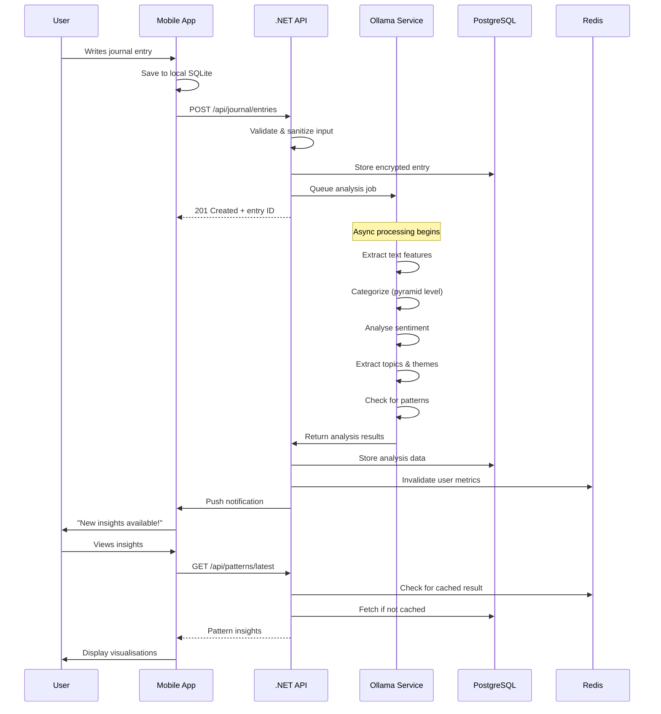
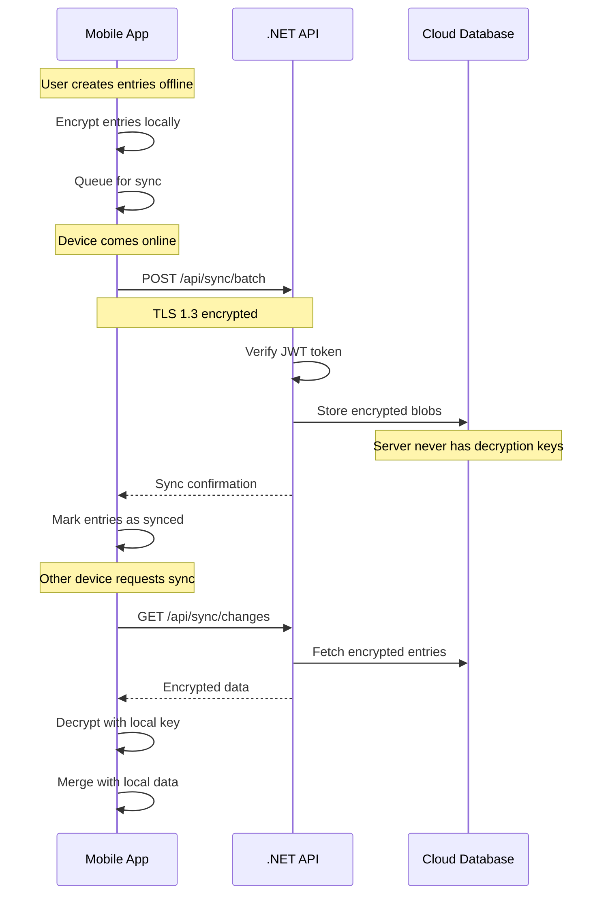

# SociallyFed: AI-Assisted Personal Development Application

## Mission

To empower individuals to develop self-awareness, emotional regulation, and healthy digital habits through a privacy-first, AI-assisted journaling and personal development framework integrating Stoic philosophy and modern psychology.

## Table of Contents

- [Theoretical Foundation](#theoretical-foundation)
- [The SociallyFed Pyramid](#the-sociallyfed-pyramid)
- [Core Features](#core-features)
- [Technical Architecture](#technical-architecture)
- [User Journey Example](#user-journey-example)
- [Differentiation](#differentiation)
- [Impact Vision](#impact-vision)
- [Development Status](#development-status)

## Theoretical Foundation

SociallyFed integrates three complementary frameworks to create a comprehensive personal development system:

### 1. Stoicism: Virtue Ethics and Reflective Practice

The Stoic philosophy provides timeless wisdom for personal development:

- **Dichotomy of Control**: Focus on what you can control (thoughts, choices, reactions) vs. what you cannot (external events, others' actions)
- **Daily Reflection**: Following Marcus Aurelius' practice of evening reviews and morning intentions
- **Virtue Alignment**: Living according to the four cardinal virtues:
  - *Wisdom* (phronesis): Sound judgment and practical wisdom
  - *Justice* (dikaiosyne): Fairness and integrity in dealings
  - *Courage* (andreia): Facing challenges with resolve
  - *Temperance* (sophrosyne): Moderation and self-control
- **Cognitive Reframing**: Viewing events through multiple perspectives to find wisdom

### 2. Cybernetic Psychology: Feedback Loops and Self-Regulation

Based on Norbert Wiener's cybernetics and modern behavioural psychology:

- **T.O.T.E. Model** (Test-Operate-Test-Exit): Continuous cycles of:
  1. Test: Compare current state to desired state
  2. Operate: Take action to reduce discrepancy
  3. Test: Re-evaluate progress
  4. Exit: When the goal is achieved, or adjust and repeat
- **Continuous Monitoring**: Like a thermostat maintaining temperature, we maintain desired psychological states
- **Goal-Directed Behaviour**: Clear standards, observation, feedback, adjustment
- **Multiple Loop Levels**:
  - *Micro-loops*: Moment-to-moment awareness
  - *Daily loops*: Morning intention → day's actions → evening reflection
  - *Weekly loops*: Progress review and strategy adjustment
  - *Macro-loops*: Long-term growth and adaptation

### 3. SociallyFed Principles: Media Literacy and Pattern Awareness

Modern research on digital wellness informs our approach:

- **The SociallyFed Pyramid**: Framework for healthy digital consumption (detailed below)
- **Active vs. Passive Use**: Research shows:
  - Passive consumption (scrolling, watching) correlates with loneliness, envy, and decreased well-being
  - Active engagement (creating meaningful interaction) correlates with connection, creativity, and satisfaction
- **Algorithmic Literacy**: Understanding how recommendation systems shape our information diet
- **Pattern Awareness**: Recognising personal triggers and responses in digital environments

## The SociallyFed Pyramid

The SociallyFed Pyramid reimagines our relationship with digital media, similar to how the food pyramid guides nutritional choices:

```
        ┌─────────────────────────────┐
        │    Served Content           │  ← Top (smallest): Minimise
        │  (Level 1)                  │
        ├─────────────────────────────┤
        │   Connection Building       │
        │  (Level 2)                  │
        ├─────────────────────────────┤
        │   Integrated Activities     │
        │  (Level 3)                  │
        ├─────────────────────────────┤
        │      Sought Content         │  ← Base (foundation): Maximise
        │  (Level 4)                  │
        └─────────────────────────────┘
```

### Pyramid Levels Explained

1. **Served Content (Top - Minimise)**:
   - At the tip of the pyramid, like sugar or addictive content in the food pyramid, this should ideally form a small part of Social Media consumption
   - Studies indicate 'Passive' usage is associated with loneliness and disconnection, which is 'served-content' provided by an algorithm
   - Drawing the parallel that 'Served-content' is much like ultra-processed foods that provide a potentially addictive, short-lived high
   - Users could live on this algorithmically driven 'Served-content', but at a cost to their well-being
   - Examples: "For You" pages, suggested posts and recommendations, auto-playing videos, algorithmic feeds, endless scroll features
   - Research Impact: Passive consumption of algorithm-served content is associated with increased feelings of loneliness and disconnection; 12.5% of people who were losing sleep reported experiencing hostile abuse

2. **Connection Building**:
   - The second layer involves using social media to build and maintain meaningful relationships and communities
   - This represents the social capital aspect of platforms
   - The study "Benefits of Facebook 'friends' social capital and college students' use of online social network sites" demonstrated that Facebook was strongest with bridging capital and gives evidence suggesting it provides greater benefits to users suffering from depression and low life satisfaction
   - Examples: Joining interest-based groups, engaging in meaningful discussions, building professional networks, maintaining friendships, supporting others seeking help
   - Research Impact: 50% of 'Active' users reported having a community that they value online that supports them; 58% had received support or connection after seeking help; 48% had an online community that values and supports them

3. **Integrated Activities**:
   - This level represents social media use that integrates with and enhances real-life activities and goals
   - The platform sustains an activity rather than replacing it
   - The study "Development and validation of a social media use integration scale" demonstrated the benefits of social media when integrated into other activities and life
   - This can help develop a support network and prevent someone from becoming emotionally attached to the platform itself
   - Examples: Coordinating real-world events, learning new skills through tutorials, supporting hobbies and interests, professional development, fundraising for causes, sports and fitness tracking
   - Research Impact: Almost 40% of survey respondents had integrated activities on all key components; Users who integrated social media with real-life activities showed significantly higher life satisfaction scores

4. **Sought Content (Foundation - Maximise)**:
   - Forming the foundation of healthy social media use, this represents content you actively seek out with intention and purpose
   - This is 'Active' usage associated with positive outcomes
   - The research "Toward an Integrated and Differential Approach to the Relationships Between Loneliness, Different Types of Facebook Use, and Adolescents' Depressed Mood" profiled that active users got better over time as opposed to passive users
   - Active usage of 'Sought Content' and posting is associated with positive outcomes
   - Examples: Searching for specific information, following curated educational content, creating and sharing meaningful content, engaging with chosen communities, and having meaningful conversations
   - Research Impact: 73.5% of respondents had found positive or helpful content; Active usage predicts subjective well-being by creating social capital and stimulating feelings of social connectedness; Those who used the platform in an 'active' manner got better over time

### Research Foundation

Studies consistently show:
- Passive social media use correlates with increased depression and anxiety (Hunt et al., 2018)
- Active use (posting, direct messaging) has neutral or positive effects (Verduyn et al., 2017)
- Algorithmic feeds designed for engagement often promote outrage and polarisation (Brady et al., 2021)
- Mindful technology use improves well-being (Lim & Bentley, 2019)

## Core Features

### 1. AI-Powered Journaling System

Our journaling system goes beyond simple prompts to create a personalised growth experience:

#### Prompt Taxonomy

Eight carefully designed categories address all aspects of personal development:

1. **Values and Virtues** (Stoic exercises)
   - "Which of the four virtues (wisdom, justice, courage, temperance) did you embody today?"
   - "Describe a moment when you acted according to your values despite difficulty"
   - "What would the ideal version of yourself have done differently today?"

2. **Emotional Awareness and Regulation**
   - "Name the emotions you experienced today. Where did you feel them in your body?"
   - "What triggered your strongest emotional reaction? How did you respond?"
   - "Practice emotional granularity: find three specific words for how you're feeling"

3. **Cognitive Reframing and Mindset**
   - "Take a challenge from today and write three different interpretations of it"
   - "What story are you telling yourself about this situation? Is it helpful?"
   - "How would you advise a good friend facing this situation?"

4. **Gratitude and Positivity**
   - "What three small things brought you joy today that you might usually overlook?"
   - "Who in your life deserves appreciation you haven't expressed?"
   - "What challenge from the past are you now grateful for?"

5. **Habits and Behaviors**
   - "Which habits served you well today? Which held you back?"
   - "What pattern do you notice in your daily routines?"
   - "Design tomorrow's keystone habit - one that will trigger other positive behaviours"

6. **Social and Relationships**
   - "How did you contribute to someone else's day?"
   - "What relationship needs attention? What's one small step you could take?"
   - "Describe a meaningful connection you made today"

7. **Media and Information Diet**
   - "Track your pyramid: How much time at each level today?"
   - "What content left you feeling energised vs. drained?"
   - "When did algorithms choose for you vs. you choosing consciously?"

8. **Progress and Planning**
   - "What moved you closer to your goals today?"
   - "What would make tomorrow 1% better than today?"
   - "Review the week: What patterns do you notice?"

#### Phase-Specific Content Strategy

The AI adapts prompts based on your journey phase:

**Phase 1: Self-Awareness (Weeks 1-4)**
- Focus: Exploration and discovery
- Prompts encourage observation without judgment
- Building vocabulary for emotions and experiences
- Establishing baseline patterns

**Phase 2: Goal Setting (Weeks 5-12)**
- Focus: Experimentation and active change
- Prompts become more action-oriented
- Setting specific, measurable improvements
- Testing strategies and noting results

**Phase 3: Deep Dive (Weeks 13-24)**
- Focus: Understanding root causes and complex patterns
- Prompts explore childhood influences, core beliefs
- Connecting present behaviours to past experiences
- Advanced Stoic exercises

**Phase 4: Maintenance (Ongoing)**
- Focus: Sustained growth and new challenges
- Prompts prevent stagnation
- Celebrating progress while seeking new edges
- Becoming a mentor to others on the journey

#### AI Features

- **Sentiment Analysis**: Tracks emotional tone over time
- **Topic Extraction**: Identifies recurring themes
- **Pattern Detection**: Finds correlations across entries
- **Prompt Personalization**: Learns which prompts resonate
- **Progress Tracking**: Measures depth of reflection

### 2. Personal Pattern Discovery

The AI analyses your journal entries and behavioural data to surface insights:

#### What Gets Tracked

**Emotional Patterns**:
- Trigger → Emotion → Response chains
- Emotional intensity and duration
- Recovery time from negative states
- Dominant emotional themes by context

**Behavioral Patterns**:
- Daily routines and their outcomes
- Habit chains and dependencies
- Energy levels throughout the day
- Decision-making tendencies

**Media Consumption Patterns**:
- Time at each pyramid level
- Transition triggers (what sends you scrolling?)
- Content type vs. mood correlation
- Peak vulnerability times

**Cross-Domain Correlations**:
- Sleep quality → Next day's media habits
- Exercise → Emotional regulation
- Social interactions → Journal sentiment
- Work stress → Evening routines

#### How Pattern Discovery Works

1. **Natural Language Processing**
   - Extracts entities, emotions, and actions from journal text
   - Identifies temporal markers ("after", "whenever", "usually")
   - Categorises content themes

2. **Statistical Analysis**
   - Correlation coefficients between variables
   - Time-series analysis for cyclical patterns
   - Anomaly detection for unusual days
   - Predictive modelling for future states

3. **Hypothesis Generation**
   - AI proposes potential patterns: "You tend to scroll social media more on days with work conflicts"
   - Confidence scores based on data strength
   - Requires user validation: "Does this match your experience?"

4. **Visualization**
   - Pattern strength meters
   - Timeline views showing when patterns are active
   - Connection maps between related patterns
   - Progress tracking as patterns change

5. **Actionable Insights**
   - Specific recommendations based on patterns
   - "If-then" implementation intentions
   - Early warning signals for negative patterns
   - Celebration of positive pattern reinforcement

### 3. Cybernetic Self-Regulation

Continuous feedback loops drive behaviour change:

#### Daily Micro-Loops

**Morning (Test)**:
1. Review yesterday's reflection
2. Set a specific intention for the day
3. Identify potential obstacles
4. Choose a focus virtue/value

**During Day (Operate)**:
- Real-time check-ins via mobile notifications
- Quick mood/energy assessments
- Gentle nudges if deviating from intention
- Celebration of aligned actions

**Evening (Test)**:
- Guided reflection on the day
- Compare intention vs. reality
- Identify what worked and what didn't
- Extract learnings for tomorrow

**Adjust (Exit or Continue)**:
- If successful: Reinforce and build on it
- If unsuccessful: Adjust strategy without judgment
- Always: Acknowledge effort and progress

#### Weekly Macro-Loops

**Sunday Planning Session**:
- Review week's patterns and progress
- Identify top 3 wins and 3 learnings
- Set weekly theme or focus area
- Schedule important activities

**Wednesday Check-in**:
- Mid-week course correction
- Energy and momentum assessment
- Adjust weekly plan if needed
- Prevent the week from derailing

**Saturday Reflection**:
- Comprehensive week review
- Pattern analysis across days
- Celebrate progress made
- Prepare insights for Sunday planning

#### Long-Term Adaptation

**Monthly Evolution**:
- Deep dive into the month's data
- Major pattern identification
- Strategy effectiveness review
- Adjust approach based on results

**Quarterly Transformation**:
- Compare to baseline from 3 months ago
- Update goals and values if they have evolved
- Graduate to new growth edges
- Share insights with the community

**Annual Milestone**:
- Full journey retrospective
- Transformation documentation
- Wisdom synthesis
- Becoming a guide for others

### 4. Privacy-First Architecture

Your data is yours alone:

#### Local LLM Processing
- All AI analysis happens on your device via Ollama
- No journal content sent to cloud services
- Models run offline after initial download
- Complete functionality without internet

#### Encryption
- End-to-end encryption for any cloud sync
- Local database encryption at rest
- Biometric locks for app access
- Secure enclave for key storage

#### Data Control
- Export all data anytime in standard formats
- Permanent deletion with secure overwrite
- Granular privacy controls
- Clear data retention policies

#### Transparency
- Open source codebase (coming soon)
- Clear explanation of all AI processing
- No hidden data collection
- Regular security audits

### 5. Measurable Growth Tracking

Quantify your development journey:

#### Self-Awareness Metrics

**Journal Insightfulness Score**:
- Depth of reflection (surface → analytical → integrated)
- Use of specific vs. vague language
- Connection-making between experiences
- Questions asked vs. statements made

**Emotion Identification Frequency**:
- Emotional vocabulary expansion
- Accuracy in labelling feelings
- Granularity of emotional descriptions
- Body awareness integration

**Pattern Acknowledgment**:
- Speed of recognising repeated behaviours
- Acceptance vs. resistance to patterns
- Self-compassion in observations
- Action taken on insights

#### Emotional Regulation Metrics

**Mood Stability Index**:
- Variance reduction over time
- Fewer extreme swings
- Quicker return to baseline
- Increased positive baseline

**Recovery Time**:
- Minutes from trigger to calm
- Effectiveness of coping strategies
- Reduction in rumination
- Increased resilience

**Reframing Success Rate**:
- Percentage of successful perspective shifts
- Speed of reframing
- Quality of alternative interpretations
- Real-world behaviour change

#### Values Alignment Metrics

**Daily Virtue Ratings**:
- Self-assessment on four Stoic virtues
- Consistency over time
- Gap between ideal and actual
- Progress toward embodiment

**Values-Action Coherence**:
- Percentage of decisions aligned with stated values
- Conflict reduction between values
- Increased clarity on priorities
- Living more authentically

#### Media Diet Metrics

**Pyramid Distribution**:
- Hours per day at each level
- Trend toward a healthier base
- Reduction in "served content"
- Increase in creation/deep focus

**Intentionality Ratio**:
- Planned vs. impulsive usage
- Conscious starts and stops
- Purpose clarity before engaging
- Satisfaction after sessions

**Well-being Correlation**:
- Mood changes post-usage
- Energy levels by content type
- Sleep quality vs. evening habits
- Productivity vs. consumption patterns

## Technical Architecture

### System Overview

```
┌─────────────────────────────────────────────────┐
│           Mobile Client (Flutter)                │
│                                                  │
│  • Journal Entry UI with rich text editor       │
│  • Pyramid visualisation dashboard              │
│  • Pattern discovery insights                   │
│  • Privacy controls and settings                │
│  • Local SQLite for offline-first               │
│  • Biometric authentication                     │
│                                                  │
│  [Works fully offline - sync when connected]    │
└────────────┬────────────────────────────────────┘
             │ HTTPS REST API (when online)
             │ JWT Authentication
             ▼
┌─────────────────────────────────────────────────┐
│        .NET Core Web API (C# / .NET 8)          │
│                                                  │
│  • RESTful endpoints for all operations         │
│  • JWT-based authentication & authorization     │
│  • Entity Framework Core ORM                    │
│  • Background pattern analysis jobs             │
│  • Rate limiting and security middleware        │
│  • Comprehensive logging and monitoring         │
│                                                  │
│  API Endpoints:                                  │
│  POST   /api/auth/register                      │
│  POST   /api/auth/login                         │
│  GET    /api/journal/entries                    │
│  POST   /api/journal/entries                    │
│  PUT    /api/journal/entries/{id}               │
│  DELETE /api/journal/entries/{id}               │
│  POST   /api/analysis/pyramid                   │
│  GET    /api/patterns/discover                  │
│  GET    /api/metrics/dashboard                  │
│  POST   /api/prompts/daily                      │
└────────────┬────────────────────────────────────┘
             │ Internal gRPC/HTTP
             │ Pattern Analysis Requests
             ▼
┌─────────────────────────────────────────────────┐
│      Local LLM Service (Python + Ollama)        │
│                                                  │
│  • Content categorisation (Pyramid levels)      │
│  • Sentiment analysis & emotion detection       │
│  • Topic extraction & theme identification      │
│  • Pattern correlation algorithms               │
│  • Hypothesis generation for user validation    │
│                                                  │
│  Models:                                         │
│  - Llama 2 7B (primary)                         │
│  - Mistral 7B (backup)                          │
│  - Custom fine-tuned models (future)            │
│                                                  │
│  [All processing local - no external API calls] │
└─────────────────────────────────────────────────┘
             │
             ▼
┌─────────────────────────────────────────────────┐
│            Data Storage Layer                    │
│                                                  │
│  • PostgreSQL (primary database)                │
│    - User accounts and preferences              │
│    - Encrypted journal entries                  │
│    - Pattern history and insights               │
│    - Metrics and analytics                      │
│                                                  │
│  • Redis (caching layer)                        │
│    - Session management                         │
│    - API response caching                       │
│    - Rate limiting counters                     │
│                                                  │
│  • Local SQLite (mobile offline storage)        │
│    - Complete mirror of user's data             │
│    - Sync queue for offline changes             │
│    - Encryption at rest                         │
└─────────────────────────────────────────────────┘
```

### Technology Stack Details

#### Backend (.NET API)
- **Framework**: ASP.NET Core 8.0 with minimal APIs
- **Authentication**: JWT tokens with refresh token rotation
- **Database**: Entity Framework Core with PostgreSQL
- **Caching**: Redis for performance optimization
- **Background Jobs**: Hosted services for pattern analysis
- **Testing**: xUnit with 85%+ coverage requirement
- **Logging**: Serilog with structured logging
- **Monitoring**: OpenTelemetry integration

#### Mobile Frontend (Flutter)
- **Framework**: Flutter 3.x for true cross-platform
- **State Management**: Riverpod for reactive architecture
- **Local Storage**: SQLite with drift ORM
- **Encryption**: flutter_secure_storage for keys
- **UI Components**: Material Design 3
- **Charts**: fl_chart for visualizations
- **Authentication**: Local biometrics + JWT

#### AI/ML Layer (Python)
- **LLM Server**: Ollama for model management
- **Inference**: Python service with FastAPI
- **Models**: Llama 2, Mistral, Phi-2
- **Processing**: spaCy for NLP preprocessing
- **Analysis**: scikit-learn for pattern detection
- **Scheduling**: Celery for async tasks

### Data Flow Examples

#### Journal Entry Creation & Analysis



#### Privacy-Preserving Sync



### Security Architecture

#### Defense in Depth

1. **Application Layer**
   - Input validation on all endpoints
   - OWASP Top 10 protections
   - Rate limiting per user/IP
   - CORS properly configured

2. **Authentication & Authorization**
   - JWT with short expiration (15 min)
   - Refresh tokens with rotation
   - Biometric authentication on mobile
   - Role-based access control

3. **Data Protection**
   - Encryption at rest (AES-256)
   - Encryption in transit (TLS 1.3)
   - Key management via secure enclave
   - No key escrow - user controls keys

4. **Infrastructure**
   - WAF for API protection
   - DDoS mitigation
   - Regular security updates
   - Penetration testing quarterly

#### Privacy by Design

- **Data Minimization**: Collect only what's needed
- **Purpose Limitation**: Use data only for stated purposes  
- **Local Processing**: AI analysis on user's device
- **User Control**: Export, delete, modify anytime
- **Transparency**: Clear privacy policy, open source

## User Journey Example

### Week 1: Onboarding and Baseline

**Day 1-2: Welcome & Setup**
- User downloads app, creates account
- Chooses privacy settings (local-only or sync)
- Takes initial assessments:
  - Current mood and stress levels
  - Digital media habits survey
  - Values identification exercise
  - Goal-setting questionnaire

**Day 3-7: Exploration**
- Daily prompts introduce journaling
- AI observes writing style and themes
- Pyramid tracker activated
- First simple insights appear

### Week 2-4: Discovery Phase

**Pattern Emergence**
- AI identifies first patterns:
  - "You mention work stress most on Mondays"
  - "Your mood improves after morning journaling"
  - "Late-night scrolling correlates with poor sleep"
- User validates or rejects patterns
- Personalisation begins

**Habit Formation**
- Morning intention-setting becomes routine
- Evening reflection feels natural
- Check-ins during day provide awareness
- First positive changes noticed

### Month 2-3: Active Change

**Experimentation**
- User sets specific goals:
  - Reduce passive scrolling by 50%
  - Increase deep focus time
  - Improve emotional regulation
- Tries different strategies:
  - Phone-free mornings
  - Scheduled social media time
  - Mindfulness breaks

**Breakthrough Moments**
- Major pattern discovered: "Social media envy → comparison → work anxiety"
- Successful reframing during a stressful event
- First week with the pyramid properly balanced
- Relationships improve from increased presence

### Month 4+: Integration and Growth

**New Normal**
- Healthy habits are now automatic
- Self-awareness becomes default
- Quick recovery from setbacks
- Helping others on the journey

**Continuous Evolution**
- Advanced prompts unlock
- Deeper psychological work
- Mentoring opportunities
- Community engagement

**Sustained Success**
- 6 months: Transformed relationship with technology
- 9 months: Significant emotional growth
- 12 months: Living aligned with values
- Ongoing: Continuous refinement and growth

## Differentiation

### vs. Generic Journaling Apps

| Feature | Generic Apps | SociallyFed |
|---------|--------------|-------------|
| Theoretical Foundation | None | Stoicism + Cybernetics |
| AI Integration | Basic or none | Advanced local LLM |
| Pattern Discovery | Manual only | Automatic with AI |
| Privacy | Often cloud-based | Local-first, encrypted |
| Behavior Change | Just tracking | Active feedback loops |
| Media Awareness | Not addressed | Core feature (Pyramid) |
| Personalization | Limited | Adaptive AI system |
| Growth Metrics | Basic mood | Comprehensive tracking |

### vs. Mood Tracking Apps

- **Beyond Numbers**: Rich journal entries provide context that mood trackers miss
- **Root Cause Analysis**: Understand why, not just what
- **Action-Oriented**: Every insight leads to actionable steps
- **Holistic Approach**: Integrates all life aspects, not just mood
- **Philosophical Grounding**: Based on proven wisdom traditions

### vs. Social Media Time Trackers

- **Quality over Quantity**: Not just reducing time, but improving how you engage
- **Educational Approach**: Understand the psychology behind your habits
- **Positive Framework**: Focus on building good habits, not just breaking bad ones
- **Comprehensive Solution**: Addresses the underlying needs that social media fills
- **Personal Growth Focus**: Media diet as part of larger development journey

### vs. AI Therapy Chatbots

- **Structured Framework**: Not open-ended chat but guided growth
- **Privacy Guaranteed**: Local processing, no data mining
- **Progress Tracking**: Measurable outcomes over time
- **Evidence-Based**: Grounded in research and philosophy
- **Complement to Therapy**: Tool for growth, not a replacement for professional help

## Impact Vision

### Individual Level

**Year 1 Outcomes**:
- 70% of users report increased self-awareness
- 65% achieve better emotional regulation
- 80% improve their media diet balance
- 75% feel more aligned with values
- 90% would recommend to friends

**Long-term Transformation**:
- Develop unshakeable self-knowledge
- Build resilience and adaptability
- Create meaningful relationships
- Find purpose and direction
- Achieve sustainable well-being

### Societal Level

**Cultural Shift**:
- Normalise reflective practices
- Reduce social media addiction
- Increase emotional intelligence
- Promote mindful technology use
- Build more conscious communities

**Research Contribution**:
- Open dataset (anonymised) for researchers
- Published studies on AI-assisted growth
- Best practices for privacy-first AI
- Framework for digital wellness
- Model for ethical technology

**Next Generation**:
- Children grow up with healthy tech habits
- Mental health destigmatised
- Self-awareness as a core life skill
- Technology serves human flourishing
- Wisdom traditions meet modern tools

## Development Status

### Completed ✓
- [x] Theoretical framework established
- [x] Technical architecture designed
- [x] Privacy-first approach defined
- [x] Pyramid framework created
- [x] Prompt taxonomy developed
- [x] Pattern discovery algorithms designed
- [x] User journey mapped

### In Progress 🚧
- [ ] Server API implementation (40% complete)
  - [x] Authentication system
  - [x] Journal entry endpoints
  - [ ] Pattern analysis integration
  - [ ] Metrics calculation
- [ ] Local LLM integration (30% complete)
  - [x] Ollama setup
  - [ ] Prompt engineering
  - [ ] Analysis pipeline
- [ ] Mobile app foundation (20% complete)
  - [x] Project structure
  - [x] Authentication flow
  - [ ] Journal UI
  - [ ] Visualisations

### Planned 📋
- [ ] Beta testing program (Q2 2025)
- [ ] Community features (Q3 2025)
- [ ] Advanced analytics (Q3 2025)
- [ ] Public launch (Q4 2025)
- [ ] Open source release (2026)

## Learn More

- **Website**: [SociallyFed.com](https://sociallyfed.com) (coming soon)
- **Email**: ben@sociallyfed.com
- **GitHub**: [github.com/ben-marino](https://github.com/ben-marino)
- **Research Papers**: 
  - [The Benefits of Active vs. Passive Social Media Use](https://doi.org/10.1089/cyber.2017.0668)
  - [Stoic Philosophy as Cognitive-Behavioral Therapy](https://doi.org/10.1353/hpq.2018.0014)
  - [Cybernetic Approaches to Self-Regulation](https://doi.org/10.1037/0033-295X.98.2.224)

---

*SociallyFed: Where ancient wisdom meets modern technology for authentic personal growth*
