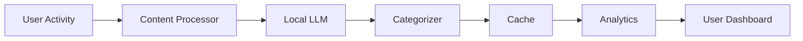

# SociallyFed Feature Specification Examples

This file contains real feature specifications created by Senior Claude during SociallyFed development, demonstrating how to translate user needs into actionable development tasks.

## Example 1: Journal Entry Encryption

**User Need:** "All journal entries must be encrypted so that even if someone gains access to the database, they cannot read the entries."

### Senior Claude Specification:

#### Feature: Journal Entry End-to-End Encryption

**Overview:**
Implement client-side encryption for all journal entries, ensuring zero-knowledge architecture where server stores encrypted data it cannot decrypt.

**Encryption Strategy:**
- Algorithm: AES-256-GCM
- Key Derivation: PBKDF2 with user passphrase
- Key Storage: Secure Enclave (iOS) / Keystore (Android)
- No key escrow: lost passphrase = lost data (with strong warnings)

**Implementation Components:**

1. **Mobile Client (Flutter):**
```dart
class JournalEncryptionService {
  // Derive encryption key from user passphrase
  Future<SecretKey> deriveKey(String passphrase, String salt);
  
  // Encrypt entry before saving
  Future<EncryptedEntry> encrypt(JournalEntry entry, SecretKey key);
  
  // Decrypt entry after fetching
  Future<JournalEntry> decrypt(EncryptedEntry encrypted, SecretKey key);
  
  // Secure key storage
  Future<void> storeKeySecurely(SecretKey key);
  Future<SecretKey?> retrieveStoredKey();
}
```

2. **API Server (.NET):**
   - Store only encrypted blobs
   - Never access decryption keys
   - Modify JournalEntry entity:
```csharp
public class JournalEntry {
    public Guid Id { get; set; }
    public string EncryptedContent { get; set; } // Base64 ciphertext
    public string Nonce { get; set; } // GCM nonce
    public DateTime CreatedAt { get; set; }
    // Metadata can remain unencrypted for indexing
    public string[] Tags { get; set; }
}
```

3. **Database Schema Update:**
```sql
ALTER TABLE JournalEntries 
ADD COLUMN encrypted_content TEXT,
ADD COLUMN nonce VARCHAR(255),
ADD COLUMN is_encrypted BOOLEAN DEFAULT TRUE;
```

**User Experience:**
- First-time: prompt to create encryption passphrase
- Explain: "Choose a strong passphrase. If forgotten, entries are unrecoverable."
- Require: minimum 12 characters, mix of character types
- Store: encrypted locally, never sent to server
- Unlock: passphrase entry on app launch, cached in memory

**Security Considerations:**
- Clear decrypted content from memory after use
- Lock app when backgrounded >5 minutes
- No screenshots allowed on journal screens
- Audit log for decryption attempts (local only)

**Testing Requirements:**
- Unit tests for encryption/decryption
- Test key derivation consistency
- Test migration of existing unencrypted entries
- Test data recovery flows
- Security audit before production

**Implementation Phases:**
- Phase 1: Implement encryption service (3 days)
- Phase 2: Integrate with mobile UI (2 days)
- Phase 3: Server-side updates (1 day)
- Phase 4: Migration strategy (2 days)
- Phase 5: Testing and audit (3 days)

**For Claude Code:**
Start with EncryptionService implementation using flutter_secure_storage and pointycastle packages. Create comprehensive tests first (TDD approach).

---

## Example 2: SociallyFed Pyramid Analysis Engine

**User Need:** "I want the app to automatically categorize my social media usage into the pyramid levels so I can see how I'm spending my time."

### Senior Claude Specification:

#### Feature: Real-time Pyramid Level Categorization

**Overview:**
Create an AI-powered system that analyzes user's digital activities and categorizes them into the 5 SociallyFed Pyramid levels, providing insights into media consumption patterns.

**System Architecture:**



**Core Components:**

1. **Activity Capture Interface:**
```csharp
public interface IActivityCapture {
    Task<Activity> CaptureManual(string description);
    Task<Activity> CaptureFromApp(AppUsageData data);
    Task<Activity> CaptureFromBrowser(BrowsingData data);
}

public class Activity {
    public string Description { get; set; }
    public DateTime Timestamp { get; set; }
    public TimeSpan Duration { get; set; }
    public string Source { get; set; } // manual, app, browser
    public Dictionary<string, object> Metadata { get; set; }
}
```

2. **Pyramid Analysis Service:**
```csharp
public interface IPyramidAnalysisService {
    Task<PyramidResult> AnalyzeActivity(Activity activity);
    Task<PyramidMetrics> GetUserMetrics(Guid userId, DateRange range);
    Task<List<Insight>> GenerateInsights(PyramidMetrics metrics);
}

public class PyramidResult {
    public int Level { get; set; } // 1-5
    public float Confidence { get; set; } // 0.0-1.0
    public string Reasoning { get; set; }
    public List<string> Indicators { get; set; }
}
```

3. **LLM Integration (Ollama):**
```python
class PyramidCategorizationPrompt:
    @staticmethod
    def build(activity_desc: str) -> str:
        return f"""
Categorize this digital activity into SociallyFed Pyramid levels:

Level 1 - Deep Focus: Mindful, purposeful, single-tasking, creation, learning
Level 2 - Content Creation: Making, building, sharing, contributing
Level 3 - Intentional Content: Consciously chosen consumption with clear purpose
Level 4 - Casual Browsing: Light engagement, general awareness, time-limited
Level 5 - Served Content: Passive consumption, algorithmic feeds, endless scrolling

Activity: "{activity_desc}"

Consider these factors:
- User intent (purposeful vs passive)
- Engagement level (active vs passive)
- Value creation (producing vs consuming)
- Time awareness (bounded vs endless)
- Choice (deliberate vs algorithmic)

Respond with JSON:
{{
    "level": 1-5,
    "confidence": 0.0-1.0,
    "indicators": ["indicator1", "indicator2"],
    "reasoning": "brief explanation"
}}
"""
```

4. **Caching Strategy:**
```csharp
public class PyramidCacheService {
    private readonly IMemoryCache _memoryCache;
    private readonly IDistributedCache _distributedCache;
    
    public async Task<PyramidResult?> GetCached(string activityHash) {
        // L1: Memory cache (5 min TTL)
        if (_memoryCache.TryGetValue(activityHash, out PyramidResult cached))
            return cached;
            
        // L2: Redis cache (1 hour TTL)
        var distributed = await _distributedCache.GetAsync(activityHash);
        if (distributed != null) {
            var result = JsonSerializer.Deserialize<PyramidResult>(distributed);
            _memoryCache.Set(activityHash, result, TimeSpan.FromMinutes(5));
            return result;
        }
        
        return null;
    }
}
```

**Analytics Dashboard:**
```typescript
interface PyramidMetrics {
    dateRange: DateRange;
    distribution: {
        level1_deepFocus: number;  // hours
        level2_creation: number;
        level3_intentional: number;
        level4_casual: number;
        level5_served: number;
    };
    trends: TrendData[];
    insights: Insight[];
    healthScore: number; // 0-100
}

interface Insight {
    type: 'positive' | 'negative' | 'neutral';
    message: string;
    data: any;
    actionable: boolean;
    suggestedAction?: string;
}
```

**Implementation Requirements:**

1. **Performance:**
   - <2 second categorization time
   - Batch processing for historical data
   - Progressive UI updates

2. **Accuracy:**
   - 90%+ categorization accuracy
   - User feedback mechanism for corrections
   - Continuous learning from corrections

3. **Privacy:**
   - All processing local via Ollama
   - No activity data sent to external servers
   - User can delete analysis history

**Test Scenarios:**
```javascript
const testCases = [
    {
        input: "Scrolled Instagram for 2 hours",
        expectedLevel: 5,
        expectedConfidence: 0.9
    },
    {
        input: "Wrote blog post about personal growth",
        expectedLevel: 2,
        expectedConfidence: 0.95
    },
    {
        input: "Watched educational video on quantum physics",
        expectedLevel: 3,
        expectedConfidence: 0.85
    },
    {
        input: "Checked news headlines for 5 minutes",
        expectedLevel: 4,
        expectedConfidence: 0.8
    },
    {
        input: "Meditated using app for 20 minutes",
        expectedLevel: 1,
        expectedConfidence: 0.9
    }
];
```

**For Claude Code:**
Begin with the PyramidAnalysisService implementation. Focus on the Ollama integration first, then build caching layer. Use TDD approach with the provided test cases.

---

## Example 3: Pattern Discovery Engine

**User Need:** "I want to understand what triggers my anxiety and how my daily habits affect my mood."

### Senior Claude Specification:

#### Feature: Behavioral Pattern Discovery System

**Overview:**
Implement an AI-powered pattern discovery engine that identifies correlations between user behaviors, emotional states, and external factors to provide actionable insights for personal growth.

**Pattern Types to Detect:**

1. **Temporal Patterns:**
   - Time-of-day correlations (e.g., "anxiety peaks at 3pm")
   - Day-of-week patterns (e.g., "Monday blues")
   - Seasonal variations

2. **Causal Patterns:**
   - Behavior → Emotion (e.g., "social media → anxiety")
   - Environment → Mood (e.g., "weather → energy levels")
   - Activity chains (e.g., "poor sleep → caffeine → jitters")

3. **Correlation Patterns:**
   - Co-occurring behaviors
   - Emotional clusters
   - Habit stacks

**Technical Architecture:**

```csharp
public interface IPatternDiscoveryEngine {
    Task<List<Pattern>> DiscoverPatterns(Guid userId, DateRange range);
    Task<CorrelationMatrix> AnalyzeCorrelations(PatternData data);
    Task<List<Hypothesis>> GenerateHypotheses(List<Pattern> patterns);
    Task<Pattern> ValidatePattern(Guid patternId, UserFeedback feedback);
}

public class Pattern {
    public Guid Id { get; set; }
    public PatternType Type { get; set; }
    public string Description { get; set; }
    public float Strength { get; set; } // 0.0-1.0
    public float Confidence { get; set; } // statistical confidence
    public int Occurrences { get; set; }
    public List<Evidence> SupportingEvidence { get; set; }
    public PatternStatus Status { get; set; } // Detected, UserValidated, Dismissed
}
```

**Data Processing Pipeline:**

1. **Feature Extraction:**
```csharp
public class FeatureExtractor {
    public FeatureSet ExtractFeatures(List<JournalEntry> entries) {
        return new FeatureSet {
            EmotionalFeatures = ExtractEmotions(entries),
            BehavioralFeatures = ExtractBehaviors(entries),
            TemporalFeatures = ExtractTimePatterns(entries),
            EnvironmentalFeatures = ExtractContext(entries),
            PyramidFeatures = ExtractMediaUsage(entries)
        };
    }
    
    private EmotionalFeatures ExtractEmotions(List<JournalEntry> entries) {
        // NLP analysis for emotion extraction
        // Sentiment scoring
        // Emotion intensity measurement
        // Valence calculation
    }
}
```

2. **Statistical Analysis:**
```python
class CorrelationAnalyzer:
    def analyze_patterns(self, features: pd.DataFrame) -> List[Correlation]:
        correlations = []
        
        # Pearson correlation for continuous variables
        continuous_corr = features.corr(method='pearson')
        
        # Spearman correlation for ordinal variables
        ordinal_corr = features.corr(method='spearman')
        
        # Chi-square for categorical associations
        categorical_associations = self.chi_square_tests(features)
        
        # Time series analysis
        temporal_patterns = self.analyze_temporal(features)
        
        # Filter significant correlations (p < 0.05, |r| > 0.3)
        significant = self.filter_significant(
            continuous_corr, 
            p_threshold=0.05, 
            r_threshold=0.3
        )
        
        return self.format_correlations(significant)
    
    def analyze_temporal(self, features: pd.DataFrame) -> List[TemporalPattern]:
        # Autocorrelation analysis
        # Seasonal decomposition
        # Trend identification
        pass
```

3. **Pattern Presentation:**
```typescript
interface PatternPresentation {
    id: string;
    type: 'temporal' | 'causal' | 'correlation';
    strength: 'strong' | 'moderate' | 'weak';
    description: string;
    visualData: ChartData;
    examples: Example[];
    hypothesis: string;
    suggestedExperiment: string;
    confidenceLevel: number;
}

// Example presentation
const anxietyPattern: PatternPresentation = {
    id: "pattern_123",
    type: "causal",
    strength: "strong",
    description: "Social media use correlates with increased anxiety",
    visualData: {
        type: "scatter",
        data: [{x: socialMediaMinutes, y: anxietyLevel}]
    },
    examples: [
        "Oct 15: 120 min Instagram → anxiety 8/10",
        "Oct 18: 30 min Instagram → anxiety 3/10"
    ],
    hypothesis: "Extended social media sessions may trigger anxiety",
    suggestedExperiment: "Try limiting social media to 30 min/day for a week",
    confidenceLevel: 0.85
};
```

**Machine Learning Components:**

```python
class PatternML:
    def __init__(self):
        self.models = {
            'clustering': DBSCAN(eps=0.5, min_samples=5),
            'anomaly': IsolationForest(contamination=0.1),
            'prediction': RandomForestRegressor(n_estimators=100)
        }
    
    def discover_hidden_patterns(self, features):
        # Cluster similar behavioral patterns
        clusters = self.models['clustering'].fit_predict(features)
        
        # Detect anomalies that might indicate triggers
        anomalies = self.models['anomaly'].fit_predict(features)
        
        # Predict future states based on patterns
        predictions = self.train_predictor(features)
        
        return self.interpret_ml_results(clusters, anomalies, predictions)
```

**Privacy & User Control:**

```csharp
public class PatternPrivacyService {
    public async Task<Pattern> AnonymizePattern(Pattern pattern) {
        // Remove identifying information
        // Generalize specific details
        // Maintain statistical validity
    }
    
    public async Task<bool> DeletePattern(Guid patternId, Guid userId) {
        // Remove pattern from user's history
        // Update aggregate statistics
        // Ensure complete deletion
    }
}
```

**Implementation Priorities:**

1. **Phase 1 - Basic Correlations (Week 1)**
   - Simple correlation detection
   - Basic temporal patterns
   - Initial user interface

2. **Phase 2 - Advanced Analysis (Week 2)**
   - Machine learning integration
   - Complex pattern chains
   - Hypothesis generation

3. **Phase 3 - User Experience (Week 3)**
   - Interactive visualizations
   - Pattern validation flow
   - Actionable insights

**For Claude Code:**
Start with the FeatureExtractor and basic correlation analysis. Implement the statistical tests first, then add the ML components. Ensure all processing remains local for privacy.

---

## Best Practices from These Examples

### 1. Start with User Need
- Translate user language into technical requirements
- Focus on the outcome, not just features

### 2. Provide Complete Context
- Include all interfaces and data structures
- Show example data and expected outputs
- Specify performance requirements

### 3. Break Down Complexity
- Divide into manageable phases
- Prioritize core functionality
- Plan for iterative improvement

### 4. Consider All Aspects
- User experience flow
- Technical implementation
- Testing strategy
- Privacy and security
- Performance constraints

### 5. Give Clear Direction
- End with specific instructions for Claude Code
- Indicate where to start
- Provide test cases

### 6. Include Examples
- Show sample inputs and outputs
- Provide test scenarios
- Include edge cases

These specifications have proven effective in the SociallyFed development workflow, resulting in high-quality implementations that meet requirements on the first attempt in most cases.