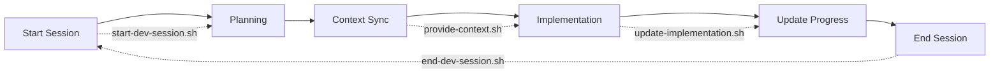

# SociallyFed AI Workflow Scripts

This directory contains automation scripts that orchestrate the multi-AI development workflow for building SociallyFed.

## Scripts Overview

| Script | Purpose | Usage |
|--------|---------|-------|
| `start-dev-session.sh` | Initialize daily development context | Run at start of each work session |
| `provide-context.sh` | Aggregate context for Claude Code | Use before implementation tasks |
| `update-implementation.sh` | Document implementation progress | Run after completing features |
| `push-implementation.sh` | Commit with contextual information | Use for git commits |
| `end-dev-session.sh` | Wrap up daily development | Run at end of work session |

## Setup

1. Make all scripts executable:
   ```bash
   chmod +x *.sh
   ```

2. Configure environment variables:
   ```bash
   export CONTEXT_DIR="$HOME/Google Drive/SociallyFed/Context"
   export PROJECT_DIR="$HOME/Development/sociallyfed"
   ```

3. Ensure Google Drive is syncing on both machines

## Daily Workflow



## Script Details

### start-dev-session.sh
- Creates daily brief with git status
- Captures pending tasks
- Opens in editor for Claude Desktop

### provide-context.sh
- Aggregates relevant context files
- Supports feature-specific filtering
- Prepares DEVELOPMENT_CONTEXT.md

### update-implementation.sh
- Interactive report creation
- Tracks what was implemented
- Updates cumulative progress log

### push-implementation.sh
- Adds contextual commit messages
- Links to daily briefs
- Maintains implementation history

### end-dev-session.sh
- Generates session summary
- Updates task tracking
- Prepares next session setup

## Best Practices

1. **Always start with `start-dev-session.sh`** - This ensures context continuity
2. **Update frequently** - Run `update-implementation.sh` after each major feature
3. **Commit often** - Use `push-implementation.sh` for contextual commits
4. **End properly** - `end-dev-session.sh` prepares tomorrow's context

## Troubleshooting

### Script not found
```bash
# Add scripts directory to PATH
export PATH="$PATH:$(pwd)"
```

### Permission denied
```bash
# Make executable
chmod +x script-name.sh
```

### Context not syncing
```bash
# Check Google Drive status
ls -la "$HOME/Google Drive/SociallyFed/Context"
```

## Customization

Scripts can be customized by modifying these variables at the top of each file:

```bash
CONTEXT_DIR="${CONTEXT_DIR:-$HOME/Google Drive/SociallyFed/Context}"
PROJECT_DIR="${PROJECT_DIR:-$HOME/Development/sociallyfed}"
EDITOR="${EDITOR:-code}"
```

## Contributing

When modifying scripts:
1. Test thoroughly before committing
2. Update this README
3. Maintain backward compatibility
4. Add error handling for new features